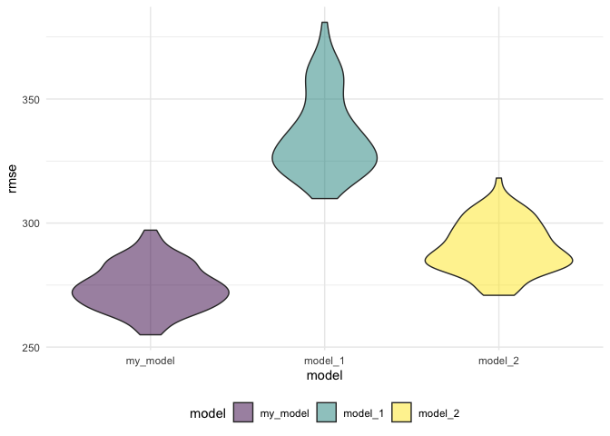

p8105\_hw6\_smm2350
================
Shaina Mackin
12/1/2021

# Homework 6

To begin, I’ll load libraries and set themes.

## Problem 1

I’ll first load the birthweight dataset…

``` r
bwt_data = read.csv("/Users/shainamackin/Desktop/Fall 2021/Data Science I/p8105_hw6_smm2350/data/birthweight.csv")
```

… and then clean it by tidying variable names and factoring when
relevant so that it’s ready for regression analysis.

``` r
bwt_df = bwt_data %>%
  mutate(
    babysex = factor(babysex),
    frace = factor(frace),
    malform = factor(malform),
    mrace = factor(mrace)
  ) %>%
  mutate(
    babysex = fct_recode(babysex, "male" = '1'),
    babysex = fct_recode(babysex, "female" = '2'),
    frace = fct_recode(frace, "white" = '1'),
    frace = fct_recode(frace, "black" = '2'),
    frace = fct_recode(frace, "asian" = '3'),
    frace = fct_recode(frace, "puerto rican" = '4'),
    frace = fct_recode(frace, "other" = '8'),
    malform = fct_recode(malform, "absent" = '0'),
    malform = fct_recode(malform, "present" = '1'),
    mrace = fct_recode(mrace, "white" = '1'),
    mrace = fct_recode(mrace, "black" = '2'),
    mrace = fct_recode(mrace, "asian" = '3'),
    mrace = fct_recode(mrace, "puerto rican" = '4')
    ) %>%
  janitor::clean_names()

colSums(is.na(bwt_df))
```

    ##  babysex    bhead  blength      bwt    delwt  fincome    frace  gaweeks 
    ##        0        0        0        0        0        0        0        0 
    ##  malform menarche  mheight   momage    mrace   parity  pnumlbw  pnumsga 
    ##        0        0        0        0        0        0        0        0 
    ##    ppbmi     ppwt   smoken   wtgain 
    ##        0        0        0        0

Note: there are no missing values.

I’ll build a linear regression model for birthweight using backwards
selection. First, I’ll include all variables as predictors in my fully
saturated model:

``` r
saturated_fit = lm(bwt ~., data = bwt_df)

saturated_fit%>%broom::tidy()%>%knitr::kable()
```

| term              |      estimate |   std.error |  statistic |   p.value |
|:------------------|--------------:|------------:|-----------:|----------:|
| (Intercept)       | -6265.3914076 | 660.4010631 | -9.4872522 | 0.0000000 |
| babysexfemale     |    28.7073088 |   8.4652447 |  3.3911966 | 0.0007021 |
| bhead             |   130.7781455 |   3.4523248 | 37.8811826 | 0.0000000 |
| blength           |    74.9535780 |   2.0216656 | 37.0751613 | 0.0000000 |
| delwt             |     4.1007326 |   0.3948202 | 10.3863301 | 0.0000000 |
| fincome           |     0.2898207 |   0.1795416 |  1.6142265 | 0.1065513 |
| fraceblack        |    14.3312853 |  46.1501283 |  0.3105362 | 0.7561682 |
| fraceasian        |    21.2361118 |  69.2959907 |  0.3064551 | 0.7592729 |
| fracepuerto rican |   -46.9962310 |  44.6782159 | -1.0518824 | 0.2929123 |
| fraceother        |     4.2969242 |  74.0740827 |  0.0580085 | 0.9537446 |
| gaweeks           |    11.5493872 |   1.4653680 |  7.8815609 | 0.0000000 |
| malformpresent    |     9.7649680 |  70.6258929 |  0.1382633 | 0.8900388 |
| menarche          |    -3.5507723 |   2.8950777 | -1.2264860 | 0.2200827 |
| mheight           |     9.7874130 |  10.3115672 |  0.9491683 | 0.3425881 |
| momage            |     0.7593479 |   1.2221417 |  0.6213256 | 0.5344182 |
| mraceblack        |  -151.4354038 |  46.0453432 | -3.2888321 | 0.0010141 |
| mraceasian        |   -91.3866079 |  71.9189677 | -1.2706885 | 0.2039079 |
| mracepuerto rican |   -56.4787268 |  45.1368828 | -1.2512766 | 0.2109013 |
| parity            |    95.5411137 |  40.4792711 |  2.3602479 | 0.0183069 |
| pnumlbw           |            NA |          NA |         NA |        NA |
| pnumsga           |            NA |          NA |         NA |        NA |
| ppbmi             |     4.3537865 |  14.8913292 |  0.2923706 | 0.7700173 |
| ppwt              |    -3.4715550 |   2.6121254 | -1.3290155 | 0.1839131 |
| smoken            |    -4.8543629 |   0.5870549 | -8.2690107 | 0.0000000 |
| wtgain            |            NA |          NA |         NA |        NA |

Second, I’ll run a backward selection using `stepAIC` from the `MASS`
package to remove all non-significant predictors from the model.

``` r
my_model = MASS::stepAIC(saturated_fit, direction = "backward", trace = FALSE)

my_model%>%broom::tidy() %>%knitr::kable()
```

| term              |      estimate |   std.error |  statistic |   p.value |
|:------------------|--------------:|------------:|-----------:|----------:|
| (Intercept)       | -6098.8219113 | 137.5463421 | -44.340124 | 0.0000000 |
| babysexfemale     |    28.5580171 |   8.4548958 |   3.377690 | 0.0007374 |
| bhead             |   130.7770408 |   3.4465672 |  37.944144 | 0.0000000 |
| blength           |    74.9471109 |   2.0190479 |  37.120027 | 0.0000000 |
| delwt             |     4.1067316 |   0.3920592 |  10.474775 | 0.0000000 |
| fincome           |     0.3180229 |   0.1747477 |   1.819898 | 0.0688436 |
| gaweeks           |    11.5924873 |   1.4620657 |   7.928842 | 0.0000000 |
| mheight           |     6.5940377 |   1.7848817 |   3.694383 | 0.0002231 |
| mraceblack        |  -138.7924801 |   9.9070869 | -14.009414 | 0.0000000 |
| mraceasian        |   -74.8867755 |  42.3146313 |  -1.769761 | 0.0768374 |
| mracepuerto rican |  -100.6781427 |  19.3246910 |  -5.209819 | 0.0000002 |
| parity            |    96.3046933 |  40.3362158 |   2.387549 | 0.0170038 |
| ppwt              |    -2.6755853 |   0.4273585 |  -6.260752 | 0.0000000 |
| smoken            |    -4.8434197 |   0.5855757 |  -8.271210 | 0.0000000 |

All coefficients in this reduced model are now statistically
significant.

The [literature](https://www.ncbi.nlm.nih.gov/pmc/articles/PMC3390317/)
confirms that smoking exposure, maternal weight, weight gain during
pregnancy, and previous LBW babies are all associated with birthweight
(Metgud et al., 2012). Race and income should also be kept in the model,
as they are statistically significant and increasingly recognized as
social determinants of maternal & neonatal health outcomes. We will also
keep height, gestational age, baby’s length, head circumference, and sex
in the model, as they are statistically significant and clinically
relevant to birthweight.

`my_model` thus includes `babysex`, `bhead`, `blength`, `delwt`,
`fincome`, `gaweeks`, `mheight`, `mrace`, `parity`, `ppwt`, and
`smoken`.

I’ll now create a plot of model residuals against fitted values.

``` r
bwt_resid = add_residuals(bwt_df, my_model) 

bwt_pred = add_predictions(bwt_df, my_model)


bwt_df %>%
  add_residuals(my_model) %>%
 add_predictions(my_model) %>%
  ggplot(aes(x = pred, y = resid)) +
  geom_point(alpha = .5) +
  labs(
    x = "Predictions",
    y = "Residuals",
    title = "Predictions against Residuals in Proposed Regression Model"
  )
```

<!-- -->

It’s now time to use cross validation to compare my model to two others:
<br/> • One using length at birth and gestational age as predictors
(main effects only) <br/> • One using head circumference, length, sex,
and all interactions (including the three-way interaction) between these

``` r
model_1 = lm(bwt ~ blength + gaweeks, data = bwt_df)
  
model_2 = lm(bwt ~ bhead + blength + babysex + bhead*blength + bhead*babysex + blength*babysex + bhead*blength*babysex, data = bwt_df)

model_1%>%broom::tidy() %>%knitr::kable()
```

| term        |    estimate | std.error | statistic | p.value |
|:------------|------------:|----------:|----------:|--------:|
| (Intercept) | -4347.66707 | 97.958360 | -44.38281 |       0 |
| blength     |   128.55569 |  1.989891 |  64.60439 |       0 |
| gaweeks     |    27.04673 |  1.717930 |  15.74379 |       0 |

``` r
model_2%>%broom::tidy() %>%knitr::kable()
```

| term                        |      estimate |    std.error |  statistic |   p.value |
|:----------------------------|--------------:|-------------:|-----------:|----------:|
| (Intercept)                 | -7176.8170221 | 1264.8397394 | -5.6740920 | 0.0000000 |
| bhead                       |   181.7956350 |   38.0542051 |  4.7772811 | 0.0000018 |
| blength                     |   102.1269235 |   26.2118095 |  3.8962180 | 0.0000992 |
| babysexfemale               |  6374.8683508 | 1677.7669213 |  3.7996150 | 0.0001469 |
| bhead:blength               |    -0.5536096 |    0.7802092 | -0.7095656 | 0.4780117 |
| bhead:babysexfemale         |  -198.3931810 |   51.0916850 | -3.8830816 | 0.0001047 |
| blength:babysexfemale       |  -123.7728875 |   35.1185360 | -3.5244319 | 0.0004288 |
| bhead:blength:babysexfemale |     3.8780531 |    1.0566296 |  3.6702106 | 0.0002453 |

I’ll first add train and test to my cross validated data frame. Then,
I’ll use mutate + map & map2 to fit models to the training data and
obtain corresponding RMSEs for the testing data.

``` r
cv_df =
  crossv_mc(bwt_df, 100) %>% 
  mutate(
    train = map(train, as_tibble),
    test = map(test, as_tibble))

cv_df2 = cv_df %>% 
  mutate(
    my_model  = map(train, ~lm(bwt ~ babysex + bhead + blength + delwt + fincome + gaweeks + mheight + mrace + parity + ppwt + smoken, data =.x)),
     model_1      = map(train, ~lm(bwt ~ blength + gaweeks, data = .x)),
     model_2      = map(train, ~lm(bwt ~ bhead + blength + babysex + bhead*blength + bhead*babysex + blength*babysex + bhead*blength*babysex, data = .x))) %>%
  mutate(
    rmse_my_model = map2_dbl(my_model, test, ~rmse(model = .x, data = .y)),
    rmse_model_1  = map2_dbl(model_1, test, ~rmse(model = .x, data = .y)),
    rmse_model_2  = map2_dbl(model_2, test, ~rmse(model = .x, data = .y)))
```

    ## Warning in predict.lm(model, data): prediction from a rank-deficient fit may be
    ## misleading

    ## Warning in predict.lm(model, data): prediction from a rank-deficient fit may be
    ## misleading

Next, I’ll plot the prediction error distribution for each model.

``` r
cv_df2 %>% 
  select(starts_with("rmse")) %>% 
  pivot_longer(
    everything(),
    names_to = "model", 
    values_to = "rmse",
    names_prefix = "rmse_") %>% 
  mutate(model = fct_inorder(model)) %>% 
  ggplot(aes(x = model, y = rmse, fill = model)) + 
  geom_violin(alpha=.5) +
  labs("RMSEs across candidate models")
```

<!-- -->

The RMSE of `my_model` is the smallest, indicating that my originally
proposed model (including sex, head circumference, length, delivery
weight, income, gestational age, mother’s height, mother’s race, parity,
pre-pregnancy weight, and smoking) is the best fitted model for our
birthweight regression. `model_2` (including head circumference, length,
sex, and all interactions between these) is the second best option,
followed by `model_1` (including length at birth and gestational age as
predictors).

## Problem 2
